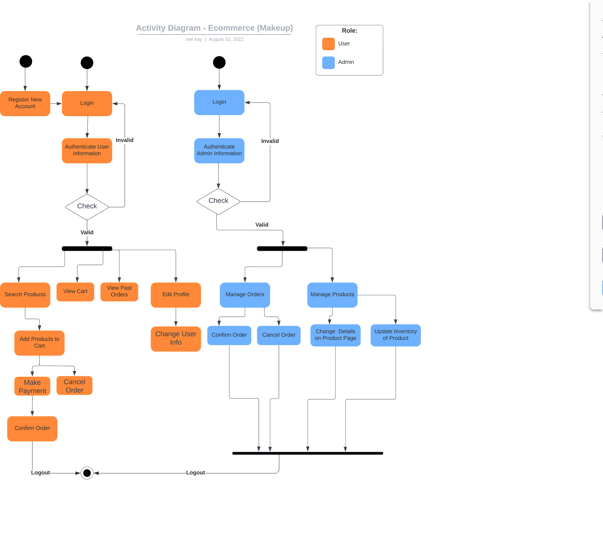
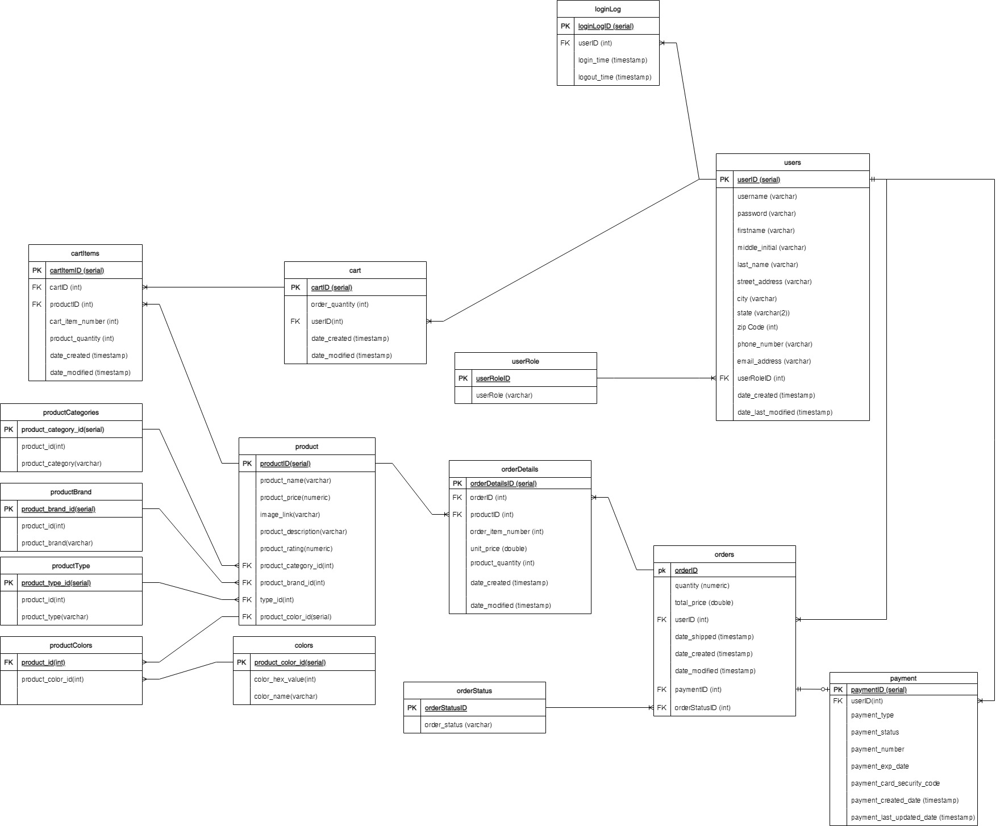
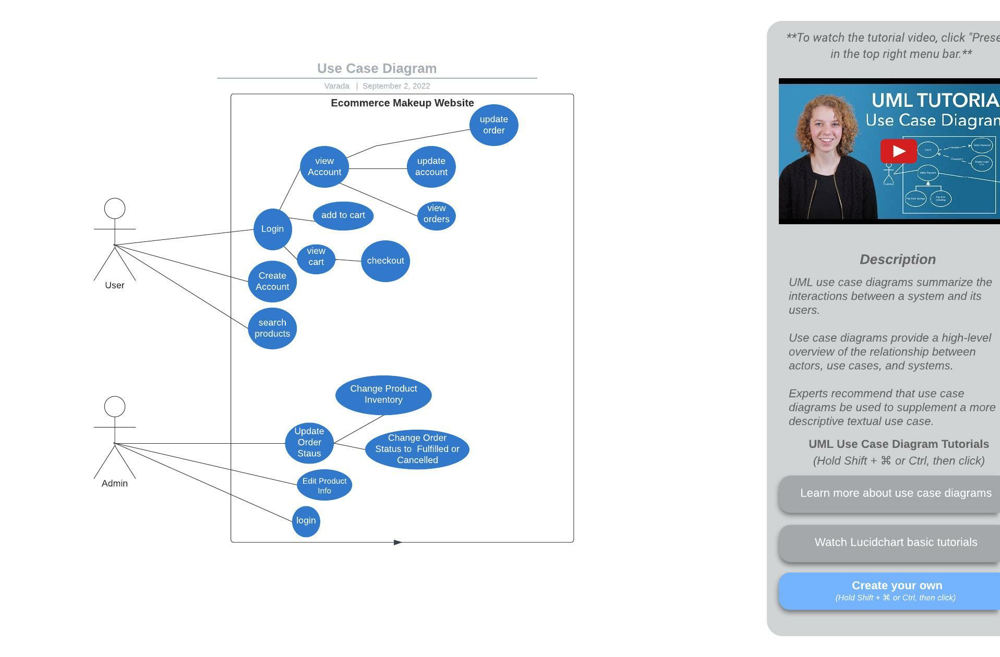
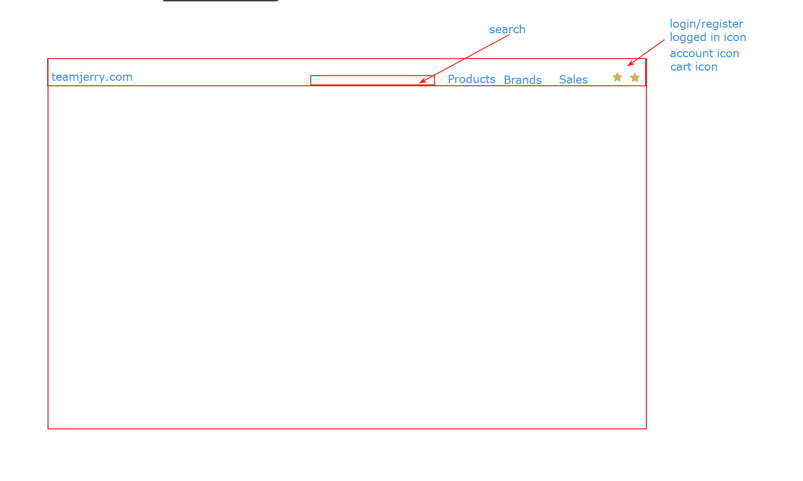

---
# **E-Commerce Project**
## _Team Jerry_

Team Jerry Logo HERE
---

### Executive Summary
***
"This project is a full-stack application depicting an ECommerce website for makeup products. This application will allow you to browse different brands and types of makeup, adding them to your cart and paying for them in a simulation of a real internet shopping experience.

This project will demonstrate an understanding of the fundamentals front-end and back-end application development. It may be expanded upon as desired."

***
### User Stories
***

#### MVP Goals (Core functionality)
1. Ability to log into the application
    - [] Username and password input

2. Ability to register a new account
    - [] Must ensure the username is not already registered
    - [] Default customer role
    
3. Customers can add items to their cart
    - [] Must have an amount (item quantity)
    
4. Product ratings to be displayed with products (star system)
    - [] Must have a rating of 0-5 stars
    
5. Customers should have an account page
    - [] Has a User Profile Pic
    - [] Has customer info (first and last name, email, shipping address, payment info)
    
6. Products should have their own product page
    - [] Has an image of the product
    - [] Has product info (name, brand, description, cost)
    - [] Has rating displayed
    
7. Customers should have access to a checkout page
    - [] Has payment information (name, card or paypal, billing address)
    - [] Has order information (quantity, cost, tax, shipping fee, delivery address confirmation)
    
8. Customers should have the ability to update their account page
    - [] Ability to change profile picture
    - [] Ability to change account information (except username)
    
9. Website should have a Home Page
    - [] Logo
    - [] Category images
    
10. Website should have a Search Bar
	- [] Search functions for products, brands, etc
	
11. Website should have categories for the products
    - [] Makeup types (face, lips, eyes)
    - [] Makeup tools (brushes, etc)
    - [] Makeup organizers
   
12. Administrators should have the ability to login
    - [] Username and password input
    
13. Administrators should have their own account page
    - [] Unique ability to update product info
    - [] Unique ability to view previous orders
    - [] Unique ability to view current orders
    

#### Stretch Goals (Additional Functionality)

1. Customers can view all their items in the cart
    - [] Must have an amount (item quantity)
    - [] Must have a price quote for the order (before shipping costs and tax, which is added in the checkout page
    
2. Customers can have the ability to view their orders page
    - [] Must have the ability to cancel orders
    - [] Must have the ability to update orders

3. Customers can view previous purchases
    - [] Can have To-Be-Shipped, Shipped, and Delivered statuses

***
### Flowcharts
***

***
### Technical Requirements
***
You are required to adhere to the following technical stacks:
- Java 8
- HTML
- CSS
- JavaScript
- PostgreSQL (hosted on AWS RDS or localhost)
- Spring Boot
- JUnit
- Mockito

***
### External API used
***

Makeup API (makeup-api.herokuapp.com)

